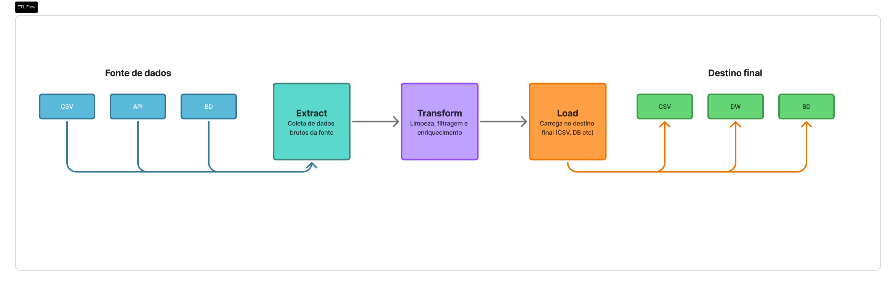

# 🎓 Análise preditiva de evasão no ensino superior baseada em fatores acadêmicos e socioeconômicos
> **Projeto Integrador: Desenvolvimento Low Code em Ciência de Dados - Grupo 03 | Senac EAD 2026**

## 📌 1. Visão Geral e Contexto
A evasão no ensino superior é uma questão social que afeta o capital humano e trava o desenvolvimento de um país a longo prazo. As causas de desistência deixam rastros nos dados (queda de notas, falta de engajamento, entre outros).

Neste projeto, utilizamos a Ciência de Dados para identificar esses padrões. Através de um dataset simulado, construíremos uma estrutura capaz de apontar quais alunos estão em risco de evasão, permitindo que a instituição tome medidas preventivas antes que o abandono aconteça.


## 👥 2. Equipe de Desenvolvimento

- Bianca da Silva
- Cauã Silva Macedo
- Diego Dias de Araujo
- Fábio Gomes da Silva
- Julio Valença de Azevedo Junior - [GitHub](https://github.com/julio-valenca)
- Ricardo Augusto Mazzarioli Ribeiro Nunes - [GitHub](https://github.com/ricmazz)
- Tamires Chorense Nunes Garrones - [GitHub](https://github.com/tamireschorense-dev)
- Vanessa Byork Ferreira Pinto


## 🎯 3. Objetivo do Projeto

O objetivo é desenvolver um script de processamento de dados para o dataset Student Dropout Prediction. O foco está na construção da lógica de tratamento e na visualização dos fatores que influenciam a evasão acadêmica.

### 3.1. Entregas previstas:

3.1.1 Questões de Análise (Perguntas de Negócio):

- Engajamento e Evasão: Qual a média de presença dos alunos que abandonaram o curso comparada aos que permaneceram?

- Perfil Demográfico e Temporal: Quais são as 10 idades com maior taxa de evasão e em quais semestres o abandono é mais frequente?

- Saúde Mental e Desempenho: Qual a média do CGPA (nota acumulada) dos alunos com nível de estresse acima de 6?

- Impacto do Trabalho: Qual a diferença no nível de estresse entre alunos que trabalham e os que não trabalham?

- Análise Institucional: Qual departamento apresenta a maior taxa de abandono?

3.1.2. Entregas Técnicas:

- Processamento: Script em Python (Pandas) para limpeza do dataset e cálculo das métricas de estresse, presença e notas.

- Visualização: Dashboard em Streamlit com filtros interativos para explorar as taxas de evasão por departamento e idade.

## 📅 4. Planejamento e Organização
O cronograma foi dividido em fases para garantir a entrega do pipeline completo:

#### 4.1. Cronograma e Atribuições de Equipa

| Categoria | Atividade | Responsáveis | Status |
| :--- | :--- | :--- | :---: |
| **Gestão** | Criação e organização do Repositório | Ricardo A. M. R. Nunes | [x] |
| **Dados** | Escolha da base de dados [Student Dropout Prediction](https://www.kaggle.com/datasets/meharshanali/student-dropout-prediction-dataset/data) | Todos os integrantes | [x] |
| **Visão geral** | Contextualização e objetivo | Tamires Chorense Nunes Garrones | [x] |
| **Estratégia** | 4.3.1. Definição dos Objetivos de Negócio | Todos os participantes | [x] |
| **Engenharia** | 4.3.2. Mapeamento das fontes de dados | Ricardo, Tamires, Vanessa | [x] |
| **Coleta** | 4.3.3. Extração (Leitura do Dataset) | Bianca da Silva, Fábio Gomes | [x] |
| **Tratamento** | 4.3.4. Transformação (Limpeza e Cálculos) | Ricardo Augusto, Fábio Gomes | [/] |
| **Integração** | 4.3.5. Carga (Conexão com Dashboard) | Ricardo Augusto | [/] |
| **Qualidade** | 4.3.6. Monitoramento e Revisão | Cauã Silva Macedo | [ ] |
| **Visualização** | 4.4. Planeamento e Criação do Dashboard | Diego, Julio, Tamires | [ ] |
| **Visualização** | 4.4.1. Gráficos de correlação e distribuição | Julio Valença | [ ] |
| **Docs** | 4.5. Organização do README e Documentação | Ricardo, Tamires | [/] |


### 4.2. Definição da base de dados
- [x] Escolha da base de dados [Student Dropout Prediction](https://www.kaggle.com/datasets/meharshanali/student-dropout-prediction-dataset/data)
  * Responsáveis: Todos os integrantes
- [x] Visão geral e Contexto
  * Responsável: Tamires Chorense Nunes Garrones
- [x] Objetivo do projeto
* Responsáveis: Todos os integrantes

### 4.3. Processamento e Análise (ETL)


- [x] Definição das tarefas e cronograma
 * Responsáveis: Todos os integrantes

#### 4.3.1. Objetivos de Negócio
- Todos os Participantes

#### 4.3.2. Mapeamento das fontes de dados
- Ricardo Augusto, Tamires Chorense, Vanessa Byork

#### 4.3.3. Extração dos Dados
- Bianca da Silva, Fábio Gomes da Silva

#### 4.3.4. Transformação dos Dados
- Ricardo Augusto, Fábio Gomes da Silva

#### 4.3.5. Carga dos Dados
- Ricardo Augusto

#### 4.3.6. Monitoramento e Revisão
- Cauã Silva Macedo

### 4.4. Dashboard e Visualização
- [x] Planejamento do Dashboard: Diego Dias, Julio Valença, Tamires Chorense
- [x] Criação de gráficos: Julio Valença de Azevedo Junior 

### 4.5. Documentação
- [x] Organização do README: Ricardo Augusto, Tamires Chorense


### 4.1. Repositório:
- [x] Criação e organização <br>
      Ricardo Augusto Mazzarioli Ribeiro Nunes
  
### 4.2. Definição da base de dados:
- [x] Escolha da base de dados Student Dropout Prediction na plataforma Kaggle <br>
      Todos os integrantes
- [x] Contexto e objetivo da análise <br>
      Tamires Chorense Nunes Garrones
  
### 4.3. Processamento e Análise (ETL):


- [x] Definição das tarefas e cronograma <br>
      Todos os integrantes

#### 4.3.1. Definição dos Objetivos de Negócio
- Todos os Participantes

#### 4.3.2. Mapeamento das fontes de dados
- Ricardo Augusto Mazzarioli Ribeiro Nunes
- Tamires Chorense Nunes Garrones
- Vanessa Byork Ferreira Pinto

#### 4.3.3. Extração dos Dados
- Bianca da Silva
- Fábio Gomes da Silva

#### 4.3.4. Transformação dos Dados
- Ricardo Augusto Mazzarioli Ribeiro Nunes
- Fábio Gomes da Silva

#### 4.3.5. Carga dos Dados
- Ricardo Augusto Mazzarioli Ribeiro Nunes

#### 4.3.6. Monitoramento e Revisão
- Cauã Silva Macedo

### 4.4. Dashboard e Visualização:
- [x] Planejamento do Dashboard <br>
      Diego Dias de Araujo <br>
      Julio Valença de Azevedo Junior <br>
      Tamires Chorense Nunes Garrones <br>

- [x] Criação de gráficos de correlação e distribuição <br>
      Julio Valença de Azevedo Junior 

### 4.5. Documentação:
- [x] Organização do README <br>
Ricardo Augusto Mazzarioli Ribeiro Nunes <br>
Tamires Chorense Nunes Garrones 
   
## 5. Tecnologias Utilizadas:
- Python
- Pandas
- Streamlit

## 6. Estrutura
```
projeto/
├── data/
│   ├── student_dropout_dataset_v3.csv
│   └── base_tratada.csv
├── src/
│   └── etl.py
└── app/
    └── dashboard.py
```
